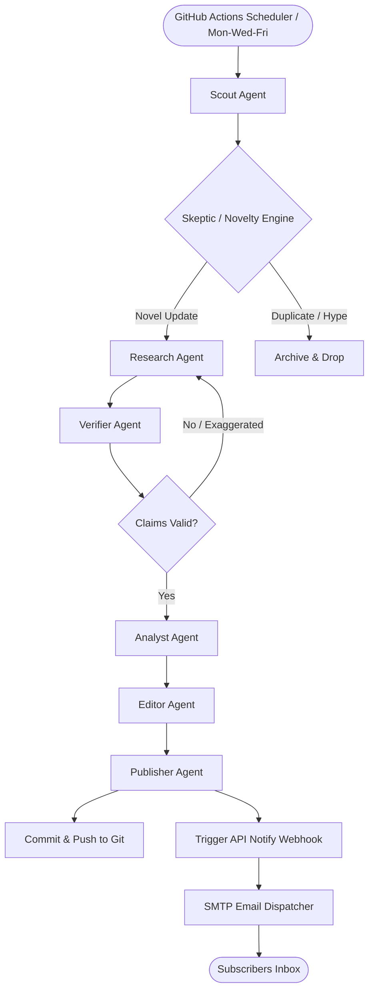

# 🚀 DailyDiff — Autonomous Agentic Tech Intelligence Platform

> **We scan the noise. Five things survive.**

**DailyDiff** is an autonomous multi-agent research and editorial platform built using **LangGraph**, **LangChain**, **FastAPI**, and **React**. Every Monday, Wednesday, and Friday, a scheduled GitHub Actions workflow wakes up the system, crawls the tech ecosystem, deduplicates findings against historical memory, fact-checks and filters out hype, and publishes a concise 3-minute tech brief. It also dispatches a personalized HTML email briefing to subscribers via Google SMTP.

---

## 🛠️ The Architecture & Agentic Workflow



1. **Scout Agent**: Scrapes trending GitHub repos, arXiv AI preprints, and Hugging Face trending daily papers.
2. **Skeptic Agent (Novelty Engine)**: Performs semantic deduplication by checking today's discoveries against our entire [history.json](data/history.json) record to filter out repeat news or marketing hype.
3. **Research Agent**: Crawls target source files, extracts repo `README.md` files or paper abstracts.
4. **Verifier Agent**: Validates technical claims (fact-checking) against the raw crawled text.
5. **Analyst Agent**: Generates the "Why it matters", "Who cares", actionable verdicts (`WATCH`, `INTEGRATE`, `READ`), and confidence ratings.
6. **Editor Agent**: Curation engine that selects the top $\le 5$ developments and maps them to briefing categories.
7. **Publisher Agent**: Saves JSON and Markdown briefs in chronological directories and pushes them back to GitHub.
8. **Email Dispatcher**: Sends personalized responsive HTML emails via **Gmail SMTP** or **Resend**.

---

## 📂 Project Structure

```text
DailyDiff/
├── .github/
│   └── workflows/
│       └── thrice_weekly_brief.yml # Cron Scheduler (Mon, Wed, Fri at 06:00 UTC)
├── backend/                     # Python FastAPI & LangGraph Engine
│   ├── app/
│   │   ├── agents/              # Pipeline nodes (scout, skeptic, verifier, etc.)
│   │   ├── config.py            # Environment configurations
│   │   ├── database.py          # SQLite database & JSON index manager
│   │   ├── email_dispatcher.py  # Gmail SMTP & Resend HTML mailer
│   │   ├── main.py              # FastAPI Web API
│   │   └── schemas.py           # Pydantic schemas
│   ├── requirements.txt         # Package dependencies
│   ├── run_agent.py             # Agent pipeline runner script
│   └── test_api.py              # API endpoint unit tests
├── frontend/                    # Vite + React Client Dashboard
│   ├── src/
│   │   ├── App.jsx              # Timeline dashboard UI
│   │   ├── index.css            # Custom CSS Glassmorphic design tokens
│   │   └── main.jsx
│   ├── package.json
│   └── vite.config.js
└── data/                        # Git-Based CMS Database
    ├── history.json             # Combined archive (historical database)
    ├── latest.md                # Latest compiled markdown report
    └── archive/                 # YYYY/MM/DD.md directory structure
```

---

## ⚡ Quick Start Guide

### 1. Prerequisite Settings

Create a `.env` file in the root directory:
```env
# AI Models Keys
GEMINI_API_KEY=AIzaSy...           # Google AI Studio API Key
MISTRAL_API_KEY=JGhIc...          # Mistral API Key

# Newsletter & Webhooks (For live email delivery to anyone)
SMTP_EMAIL=yourname@gmail.com
SMTP_PASSWORD=abcdefghijklmnop    # Google App Password (16-char code)

# Webhook URLs
BACKEND_API_URL=http://localhost:8000
NOTIFY_SECRET_TOKEN=generate_any_secure_token_string
```

> [!TIP]
> **Generating Google App Passwords**: Go to your Google Account Settings $\rightarrow$ Security $\rightarrow$ App Passwords. Choose "Other" and name it `DailyDiff` to receive a 16-character password to use as `SMTP_PASSWORD`.

---

### 2. Boot up the Backend

First, spin up your Python virtual environment and install packages:
```bash
# Create and activate environment
uv venv --python 3.12
source .venv/bin/activate

# Install dependencies
uv pip install -r backend/requirements.txt
```

Launch the FastAPI web service:
```bash
export PYTHONPATH=backend
uvicorn app.main:app --port 8000 --reload
```
The server will start at `http://localhost:8000`. You can check the documentation at `/docs`.

---

### 3. Run the Agent Pipeline

To run the agent workflow and compile today's briefing:
```bash
export PYTHONPATH=backend
source .venv/bin/activate
python backend/run_agent.py
```
*(If no API keys are found, the pipeline automatically falls back to **Simulation Mode** and creates simulated briefs to test folders, database commits, and SMTP emails).*

---

### 4. Boot up the React Client

Navigate into the frontend folder, install npm packages, and start the development server:
```bash
cd frontend
npm install
npm run dev
```
Open **`http://localhost:5173`** in your browser to interact with the responsive, glassmorphic timeline dashboard.

---

## 📬 Subscription Flow

1. **Register**: Users insert their email on the frontend website.
2. **Persistence**: The FastAPI server saves it privately in a local SQLite database (`subscribers.db`).
3. **Notification**: At the end of a successful run, `run_agent.py` calls the secure webhook `POST /api/notify-subscribers` on the server.
4. **Mailing**: The server pulls the subscription table, structures a responsive HTML newsletter, and dispatches it securely using Google SMTP (or Resend API fallback).

---

## 🧪 Testing the API

We write standard Pytest-compatible tests using `unittest`. Run the test suite:
```bash
export PYTHONPATH=backend
source .venv/bin/activate
python -m unittest backend/test_api.py
```
